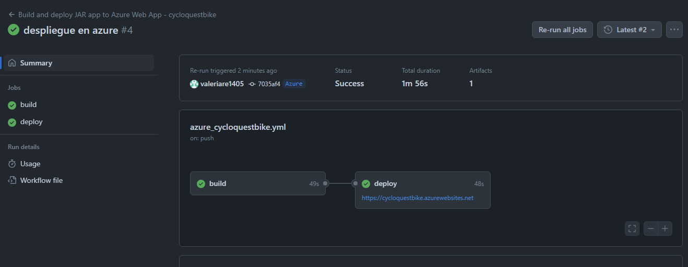
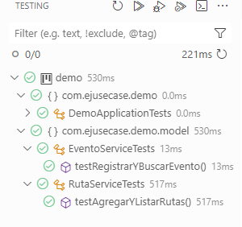
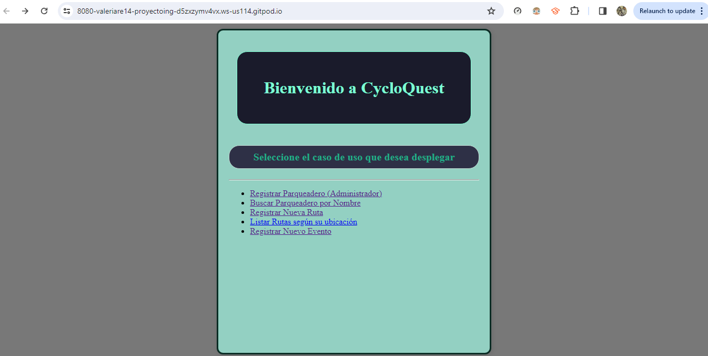
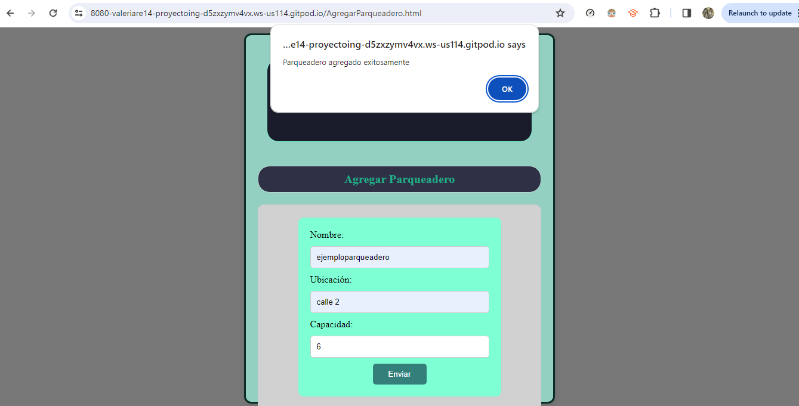
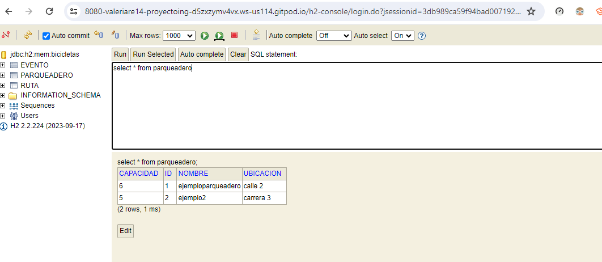

# Casos de Uso
---

* [CU001 - Registro de Parqueaderos](CU001-registrar-parqueadero.md)
* [CU002 - Búsqueda de Parqueadero por Nombre](CU002-buscar-nombre.md)
* [CU003 - Lista de Rutas](CU003-listar-rutas.md)
* [CU004 - Registro de Eventos](CU004-registrar-evento.md)

# Descripción del Proyecto

El proyecto "CycloQuest" es una aplicación web desarrollada para facilitar la gestión y exploración de recursos relacionados con el ciclismo. Utiliza tecnologías como Java, JavaScript, H2 (una base de datos embebida) y Spring Boot para proporcionar funcionalidades clave como el registro de parqueaderos, búsqueda de parqueaderos por nombre, lista de rutas recomendadas y registro de eventos de ciclismo.

## Funcionalidades

El proyecto se desarrolla en varios sprints, cada uno centrado en implementar una funcionalidad específica:

### Sprint 1: Registro de Parqueaderos (CU001)

Permite a los administradores registrar nuevos parqueaderos con detalles como nombre, ubicación y capacidad. Este sprint establece la base para la gestión de lugares seguros para estacionar bicicletas.

### Sprint 2: Búsqueda de Parqueaderos por Nombre (CU002)

Facilita a los usuarios encontrar parqueaderos específicos introduciendo su nombre. Esto mejora la experiencia del usuario al proporcionar una forma rápida de localizar lugares de estacionamiento cercanos.

### Sprint 3: Lista de Rutas (CU003)

Ofrece a los usuarios una lista de rutas recomendadas basadas en su ubicación y preferencias. Esta función fomenta la exploración al proporcionar sugerencias de rutas interesantes y seguras para montar en bicicleta.

### Sprint 4: Registro de Eventos (CU004)

Permite a los usuarios registrar eventos de ciclismo, incluyendo detalles como fecha, hora, ubicación y descripción. Esto fomenta la comunidad al facilitar la organización de eventos ciclistas locales.

## Tecnologías Utilizadas

- **Java**: Utilizado en el backend para la lógica de negocio y la gestión de datos.
- **JavaScript**: Empleado en el frontend para la interactividad y dinamismo de la aplicación.
- **H2 Database**: Una base de datos embebida utilizada para almacenar los datos de la aplicación.
- **Spring Boot**: Framework de desarrollo de aplicaciones Java que simplifica la creación de aplicaciones basadas en Spring.

## Aplicación y Potencial de Uso

"CycloQuest" es capaz de simplificar la gestión de recursos relacionados con el ciclismo, como parqueaderos y rutas, y facilitar la organización de eventos ciclistas. Esta aplicación podría ser utilizada por administradores de ciudades, comunidades ciclistas, organizadores de eventos deportivos y entusiastas del ciclismo en general.

## Proceso de Desarrollo

El proyecto se desarrolló utilizando un enfoque ágil, con iteraciones cortas y frecuentes para agregar nuevas funcionalidades y mejorar la experiencia del usuario. Cada sprint se centró en implementar una característica específica, desde el registro de parqueaderos hasta la lista de rutas recomendadas y el registro de eventos. Se realizaron pruebas exhaustivas para garantizar el correcto funcionamiento de la aplicación y se recopilaron comentarios de los usuarios para realizar ajustes y mejoras continuas.

## Futuros Desarrollos

Con las funcionalidades principales implementadas, el proyecto podría expandirse en el futuro para incluir características adicionales como la integración con aplicaciones de navegación para ciclistas, la capacidad de realizar reservas en parqueaderos, la inclusión de información sobre el terreno y la dificultad de las rutas, y la posibilidad de compartir eventos en redes sociales. Estas mejoras podrían implementarse en sprints adicionales para continuar agregando valor a la aplicación y satisfacer las necesidades de los usuarios.

## Reglas de Negocio

1. **Unicidad de Nombre de Parqueaderos**: No se pueden registrar dos parqueaderos con el mismo nombre en la misma ubicación. Esto garantiza que los usuarios puedan encontrar fácilmente un parqueadero específico sin confusión.

2. **Capacidad Máxima de Parqueaderos**: La capacidad máxima de un parqueadero no puede superar un límite predefinido, por ejemplo, 100 bicicletas. Esto evita la sobrecarga y garantiza que los parqueaderos sean gestionables y eficientes.

3. **Validación de Datos de Ruta**: Antes de registrar una nueva ruta, se debe validar que la distancia y la duración de la ruta sean razonables. Por ejemplo, una ruta que cubre una distancia muy corta o muy larga puede no ser práctica para los usuarios.

4. **Horario de Eventos de Ciclismo**: Los eventos de ciclismo deben tener un horario específico y no pueden superponerse con otros eventos en la misma ubicación. Esto garantiza que los usuarios puedan participar en múltiples eventos sin conflictos de programación.

5. **Privacidad de los Usuarios**: La información personal de los usuarios, como su nombre, dirección de correo electrónico y detalles de contacto, debe mantenerse privada y solo ser accesible para fines autorizados, como el registro de eventos.

6. **Seguridad de los Datos**: Se deben implementar medidas de seguridad adecuadas para proteger la integridad y confidencialidad de los datos del usuario, así como para prevenir accesos no autorizados o manipulación de datos.

7. **Compatibilidad con Dispositivos Móviles**: La aplicación debe ser compatible con dispositivos móviles para garantizar que los usuarios puedan acceder y utilizar todas las funcionalidades de manera óptima desde sus teléfonos inteligentes o tabletas.

**PRUEBAS** 
- Prueba Despliegue Azure]

- Pruebas Unitarias y Testing correcto

- Pantalla Inicial

- Caso de Uso de Ejemplo funcional CU001

- Funcionamiento de Pantalla con Base de Datos
